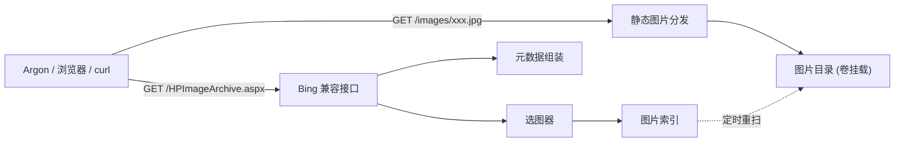
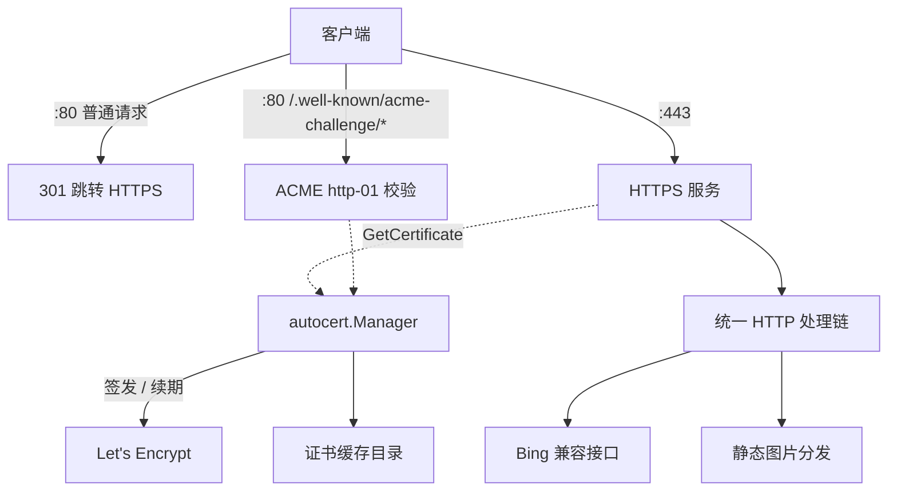
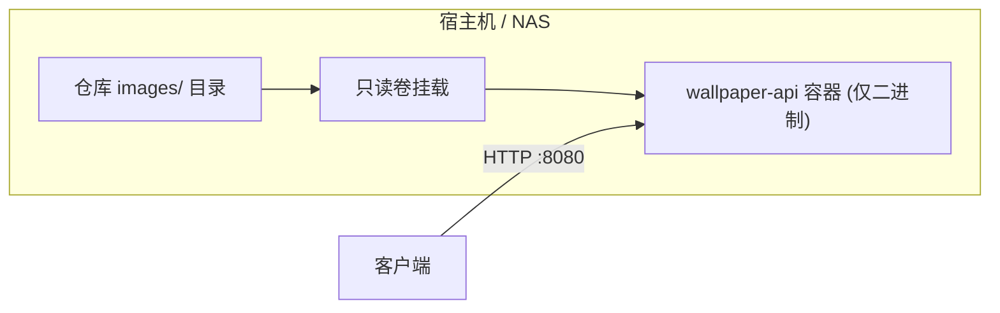
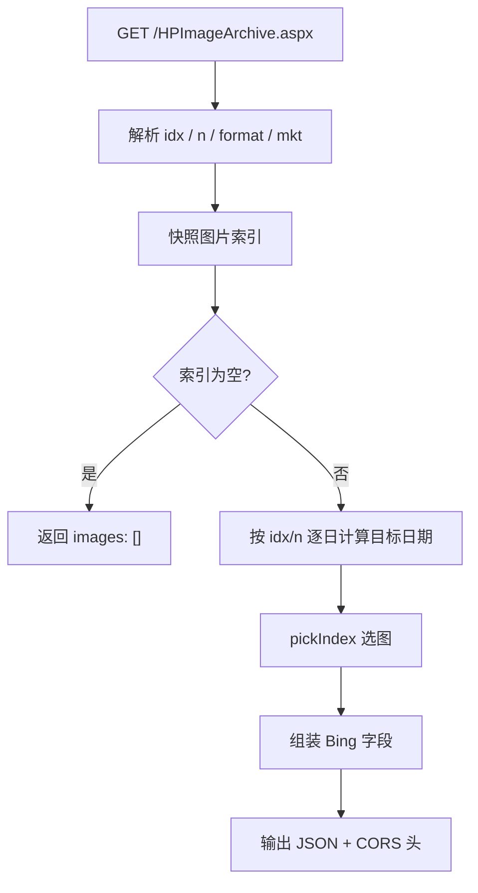

# Wallpaper API 技术设计

Feature Name: wallpaper-api
Updated: 2026-09-30

## Description

一个用 Go 编写的自托管壁纸服务，对外提供一个 Bing 兼容的图片列表接口
`GET /HPImageArchive.aspx`，并负责分发 `images/` 目录下的图片文件。目标是让
OpenWrt Argon 主题等客户端通过"替换接口地址"的方式使用自有图库：接口响应的
`images[0].url` 指向本服务的图片地址，客户端解析逻辑无需改动。

图片以仓库 `images/` 目录为唯一数据源，按"日期天数序号对图片总数取模"确定性选图，
因此同一天同一参数的请求结果稳定可复现，便于客户端与反向代理缓存。

## Architecture

服务为无状态单进程：启动时构建图片索引，按配置间隔后台重扫；HTTP 层只负责参数解析、
选图、组装 JSON 与分发静态图片。图片不进镜像，通过只读卷挂载，镜像保持极小。

服务支持两种监听模式：未配置域名时为 IP 模式，仅启动单个 HTTP 服务；配置域名后进入
域名模式，额外启动一个 HTTPS 服务，HTTP 服务转为 ACME 校验与跳转。



域名模式下的监听结构：



部署拓扑（图片不进镜像）：



## Components and Interfaces

### 配置模块 `config`

从环境变量读取配置，未设置时回退默认值。

| 环境变量 | 默认值 | 说明 |
|----------|--------|------|
| `WALLPAPER_ADDR` | `:8080` | HTTP 监听地址 |
| `WALLPAPER_IMAGES_DIR` | `./images` | 图片目录（容器内建议 `/data/images`） |
| `WALLPAPER_BASE_URL` | 空 | 图片绝对 URL 前缀；为空时由请求 `Host` 推导 |
| `WALLPAPER_COPYRIGHT` | `Wallpaper Collection` | 版权文案，参与拼接 `copyright` |
| `WALLPAPER_TIMEZONE` | `Local` | 计算"今天"所用时区，如 `Asia/Shanghai` |
| `WALLPAPER_RESCAN_INTERVAL` | `60s` | 图片目录重扫间隔，`0` 表示不重扫 |
| `WALLPAPER_LOG_LEVEL` | `info` | 日志级别 |
| `WALLPAPER_DOMAIN` | 空 | 域名，逗号分隔；非空即启用域名模式 |
| `WALLPAPER_ACME_EMAIL` | 空 | ACME 账户邮箱 |
| `WALLPAPER_ACME_CACHE_DIR` | `./certs` | 证书缓存目录（容器内建议 `/data/certs`） |
| `WALLPAPER_ACME_STAGING` | `false` | 是否使用 Let's Encrypt 测试目录 |
| `WALLPAPER_HTTP_ADDR` | `:80` | 域名模式下的 HTTP 监听地址 |
| `WALLPAPER_HTTPS_ADDR` | `:443` | 域名模式下的 HTTPS 监听地址 |

### 图片索引 `index`

职责：递归扫描目录、过滤受支持扩展名、稳定排序、提供只读快照。

```go
type Image struct {
    RelPath string // 相对图片根目录的路径，用作 URL 路径
    Name    string // 文件名（去扩展名），用作 title
    ModTime time.Time
}

type Index struct {
    images []Image // 按 RelPath 字典序稳定排序
}

func (i *Index) Snapshot() []Image // 返回切片快照，避免读写竞争
func (i *Index) Refresh(root string) error
```

受支持扩展名：`jpg`、`jpeg`、`png`、`webp`、`gif`、`bmp`、`avif`（大小写不敏感）。
排序规则固定为 `RelPath` 字典序，保证进程重启后顺序不变。

### 选图器 `selector`

职责：由目标日期确定图片下标，纯函数、无副作用，便于单测。

```go
// dayNumber 返回自 Unix 纪元（UTC）起的天数序号
func dayNumber(t time.Time) int64

// pickIndex 计算选中图片在索引中的下标
// n 为索引长度，dayNo 为目标日期的天数序号
func pickIndex(dayNo int64, n int) int
```

规则（对应需求 3）：

1. 在配置时区下取"今天"，`target = today - idx 天`。
2. `dayNo = dayNumber(target)`（按 `target` 所在时区到 UTC 的天数序号）。
3. `index = ((dayNo % n) + n) % n`，保证非负。
4. `n>1` 时对 `idx..idx+n-1` 每个偏移独立按上述规则选图。

### 元数据组装 `bing`

职责：把一张图片与目标日期组装为 Bing 字段结构（对应需求 1、7）。

```go
type BingImage struct {
    URL           string `json:"url"`
    URLBase       string `json:"urlbase"`
    Copyright     string `json:"copyright"`
    CopyrightLink string `json:"copyrightlink"`
    Title         string `json:"title"`
    StartDate     string `json:"startdate"`
    FullStartDate string `json:"fullstartdate"`
    EndDate       string `json:"enddate"`
    WP            bool   `json:"wp"`
    HSH           string `json:"hsh"`
    Drk           int    `json:"drk"`
    Top           int    `json:"top"`
    Bot           int    `json:"bot"`
    Quiz          string `json:"quiz"`
}

type BingResponse struct {
    Images []BingImage `json:"images"`
}
```

字段映射：

| 字段 | 取值 |
|------|------|
| `url` | `<BaseURL>/images/<RelPath>` |
| `urlbase` | `<BaseURL>/images/<RelPath 去扩展名>` |
| `copyright` | `<Title> (© <WALLPAPER_COPYRIGHT>)` |
| `copyrightlink` | 同 `url` |
| `title` | `<Name>` |
| `startdate` / `enddate` | 目标日期 `YYYYMMDD` |
| `fullstartdate` | 目标日期 `YYYYMMDD` + `0000` |
| `wp` | `true` |
| `hsh` | `sha1(RelPath)` 的十六进制前 16 位（确定性） |
| `drk` / `top` / `bot` | `0` |
| `quiz` | `""` |

### HTTP 层 `server`

路由：

| 方法与路径 | 说明 |
|------------|------|
| `GET /HPImageArchive.aspx` | Bing 兼容图片列表接口 |
| `GET /images/*` | 图片文件分发 |
| `GET /healthz` | 健康检查 |

接口处理流程：



图片分发使用 `http.FileServer` 配合 `http.Dir`，并对请求路径做根目录包含校验，
拒绝 `..` 跳转与越界路径。

### ACME 模块 `acme`

封装 `golang.org/x/crypto/acme/autocert`，构造证书管理器（对应需求 10）。

```go
func NewManager(cfg config.Config) *autocert.Manager
```

- `HostPolicy` 使用 `autocert.HostWhitelist(cfg.Domains...)`，TLS 握手阶段即拒绝未配置域名。
- `Cache` 使用 `autocert.DirCache(cfg.ACMECacheDir)`，证书落盘后重启复用。
- `Prompt` 使用 `autocert.AcceptTOS` 表示接受 CA 服务条款。
- 启用测试环境开关时，把 `Client.DirectoryURL` 指向 Let's Encrypt 测试目录。
- HTTPS 服务使用 `manager.TLSConfig()`，其 `NextProtos` 同时启用 HTTP/2 与 tls-alpn-01。

### 进程编排 `main`

- `config.TLS()` 为真时进入域名模式：同时启动 HTTPS 服务与 HTTP 服务，任一监听失败即返回错误退出。
- HTTP 服务使用 `manager.HTTPHandler(redirectToHTTPS())`：ACME 挑战路径由 autocert 处理，其余请求 301 跳转。
- 收到退出信号后，两个 HTTP 服务并行优雅关闭。

## Data Models

服务无持久化状态，数据模型即内存中的 `Index` 与请求/响应结构。

- `Index`：图片列表快照，由后台 goroutine 周期性重建，读取方通过原子替换获取快照指针。
- `BingResponse`：接口响应体，序列化后返回，无状态、可重复生成。

域名模式下唯一的持久化数据是证书缓存目录，由 autocert 以 `DirCache` 格式写入，服务不直接解析其内容。

## Correctness Properties

1. **确定性**：图片索引与目标日期不变时，相同 `idx`/`n` 必然返回相同图片与相同字段（`hsh` 除外均为纯函数）。
2. **健壮性**：`index = ((dayNo % n) + n) % n` 恒落在 `[0, n)`，`n>0` 时不会越界。
3. **日期单调性**：`idx` 每增加 1，目标日期恰好前移一天，选图结果按索引顺序循环前移。
4. **路径安全**：图片分发路径经根目录包含校验，任何解析后不在图片根目录内的路径均返回 404。
5. **空集安全**：图片索引为空时接口返回合法 JSON 且不 panic。
6. **绝对 URL**：`url` 始终为绝对地址，不依赖客户端的相对路径解析。
7. **模式互斥**：域名列表为空时只启动 HTTP 服务，非空时只启动 HTTPS 与跳转用的 HTTP 服务，不存在请求被重复处理的情况。
8. **域名白名单**：域名模式下，未配置域名的 TLS 握手必然失败，接口不会对未授权域名返回内容。
9. **证书复用**：证书缓存目录中存在未过期且匹配域名的证书时，服务直接使用，不触发新的 ACME 签发。

## Error Handling

| 场景 | 行为 |
|------|------|
| `idx`/`n` 非法 | 使用默认值 `idx=0`、`n=1`，正常返回 200 |
| 图片索引为空 | 返回 200 与 `{"images":[]}` |
| 图片文件不存在 | 返回 404 |
| 路径越界（含 `..`） | 返回 404 |
| JSON 序列化失败 | 返回 500，记录错误日志 |
| 图片目录不存在 | 启动不受影响，后台重扫为空索引，记录告警日志 |
| 图片目录读取错误 | 保留上一次有效索引，记录错误日志 |
| 域名模式端口被占用 | 对应监听返回错误，进程退出并记录错误日志 |
| 未配置域名访问 HTTPS | TLS 握手失败并在日志记录 `not configured in HostWhitelist` |
| 证书无法签发（端口不可达/域名未解析） | TLS 握手失败并记录错误，服务保持运行，缓存修复后自动重试 |
| 证书缓存目录不可写 | 记录错误日志，证书无法持久化，服务仍可运行 |

## Test Strategy

选图器与元数据组装为纯函数，是测试重点：

1. `pickIndex` 表驱动测试：覆盖不同 `n`、跨天边界、负数取模、大 `dayNo`。
2. 日期计算测试：用固定时区与固定时间，断言 `today - idx` 与 `startdate/fullstartdate/enddate` 格式。
3. 元数据测试：断言字段映射、`copyright` 拼接、`hsh` 确定性。
4. 索引测试：用临时目录构造嵌套图片与干扰文件，断言过滤、排序、空目录行为。
5. HTTP 层测试：`httptest` 断言接口状态码、`Content-Type`、CORS 头、`images` 元素数量、`idx`/`n` 边界。
6. 安全测试：构造 `..` 与越界路径，断言返回 404。
7. 部署验证：`docker build` 后以空目录挂载启动，断言 `/healthz` 返回 200、接口返回空数组。
8. 配置测试：断言域名解析（大小写、协议前缀、去重、逗号分隔）、IP 模式默认值、域名模式 Base URL 推导与显式覆盖。
9. ACME 测试：断言 `HostPolicy` 接受已配置域名并拒绝其他域名、测试环境开关指向测试目录、`TLSConfig` 同时启用 HTTP/2 与 tls-alpn-01。
10. 域名模式联调：预置自签证书到缓存目录后启动服务，断言 HTTPS 接口与图片可用、HTTP 普通路径 301 跳转、ACME 挑战路径不被跳转、未授权域名在握手阶段被拒绝。该方式离线验证 HTTPS 链路，无需真实签发证书。

## References

[^1]: (Website) - [Bing HPImageArchive 接口参数与字段说明](https://blog.csdn.net/qq_40732336/article/details/157290803)
[^2]: (Repository) - [luci-theme-argon 主题仓库](https://github.com/jerrykuku/luci-theme-argon)
