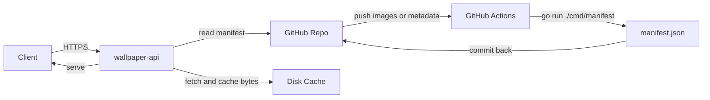

# WallpaperHub v2 技术设计

Feature Name: wallpaperhub-v2
Updated: 2026-09-30

## Description

把壁纸服务实现为自托管的 Go 进程：

- 图片以 GitHub 仓库为唯一人工编辑入口，推送后由 GitHub Actions 生成 `manifest.json` 并提交回仓库。
- 服务读取清单，从 GitHub 拉取图片字节并写入本地磁盘缓存，对外提供检索、筛选、取图接口。
- 取图支持 `random` / `seed` / `daily` / `session` 四种模式，参数切换。
- 用 Docker 与 Docker Compose 部署，栈内 Caddy 容器负责 TLS 证书与反向代理。

服务只提供原生 REST 接口，不含必应兼容路由，也不依赖 Cloudflare。

## Architecture



请求链路：

1. 客户端请求 `/v1/random`，服务读取清单，按筛选条件与模式选出一张图片。
2. 服务返回该图片的 JSON 描述，其中 `url` 指向 `/v1/images/{id}/file`。
3. 客户端请求图片地址，服务首次从 GitHub 拉取并写入磁盘缓存，之后直接读缓存；响应带 `ETag`
   与长期缓存头，支持 `Range` 与条件请求。
4. 客户端带 `redirect=1` 时，`/v1/random` 直接 302 到图片地址。

分层职责：

- 边缘层（栈内的 Caddy 容器）：TLS 证书签发与续期、反向代理、基础防护。
- 业务层：路由、筛选、取图模式、清单解析、错误规范、限流、防盗链。
- 存储层：清单来源（本地文件或 HTTP）与图片字节（本地目录或 GitHub raw + 磁盘缓存）。
- 数据层：GitHub 仓库中的图片、元数据与清单。

## Components and Interfaces

### 目录结构

仓库为单一 Go 模块，图片与元数据保留在根目录。

```
main.go                     # 启动、清单刷新、HTTP 监听
cmd/manifest/main.go        # 清单生成器
internal/config/            # 环境变量配置
internal/manifest/          # 清单模型与解析
internal/catalog/           # 清单缓存与刷新（文件或 HTTP）
internal/filter/            # 筛选条件归一化与匹配
internal/selection/         # 四种取图模式
internal/session/           # 会话标识推导
internal/store/             # 图片字节：本地目录或 GitHub raw + 磁盘缓存
internal/imaging/           # 宽高解析（含最小化 AVIF 解析）
internal/errs/              # 结构化错误
internal/server/            # 路由、序列化、限流、防盗链、日志
deploy/caddy/Caddyfile      # Caddy 容器站点配置
images/                     # 图片目录
metadata.json               # 人工维护的元数据源
manifest.json               # 生成的清单，提交在仓库中
.github/workflows/manifest.yml
Dockerfile
docker-compose.yml
```

### 路由契约

所有接口前缀 `/v1`，响应为 JSON；错误统一为 `{"error":{"code":"...","message":"..."}}`。

`GET /v1/random`

| 参数 | 说明 |
|------|------|
| `mode` | `random`（默认）、`seed`、`daily`、`session`；非法值按 `random` |
| `seed` | 配合 `mode=seed`，相同筛选与种子返回同一张 |
| `date` | 配合 `mode=daily`，格式 `YYYY-MM-DD`，默认按配置时区当天 |
| `session` | 配合 `mode=session` 的显式会话标识 |
| `tags` | 逗号分隔，需全部命中 |
| `category` | 单选分类 |
| `orientation` | `landscape` / `portrait` / `square` |
| `min_width`、`min_height` | 尺寸下限 |
| `redirect` | `1` 时返回 302 到图片字节地址 |

`GET /v1/images`：与 `/v1/random` 相同筛选参数，外加 `page`（默认 1）、`page_size`（默认 24，上限 100），按 `id` 升序返回。
响应为 `{"total":8,"page":1,"page_size":24,"items":[...]}`。

`GET /v1/images/{id}`：返回单张元数据，不存在返回 404。

`GET /v1/images/{id}/file`：返回图片字节；设置 `Content-Type`、`ETag`（等于内容摘要）、
`Cache-Control: public, max-age=31536000, immutable`；支持 `If-None-Match`、`Range` 与 `HEAD`。

`GET /v1/tags`、`GET /v1/categories`：返回 `{"items":[{"name":"anime","count":3}]}`，按数量降序、名称升序排列。

`GET /healthz`：返回 `{"status":"ok","images":8,"manifest_generated_at":"..."}`；清单未就绪时返回 503。

`GET /`：返回接口索引。

### 存储封装

`store.Store` 暴露最小接口：

```go
type Store interface {
    Open(ctx context.Context, relPath string) (Opened, error)
}
```

- `LocalStore` 从 `WALLPAPER_ROOT` 下的文件读取，路径经安全拼接防止越权。
- `GitHubStore` 从 `WALLPAPER_GITHUB_RAW_BASE` 拼出原始内容地址，首次下载写入
  `WALLPAPER_CACHE_DIR`（先写临时文件再重命名），命中缓存时直接读文件。

`catalog.Catalog` 用 `FileFetcher` 或 `HTTPFetcher` 获取清单文本，解析后以原子指针替换快照；
刷新失败时保留旧清单。

### 限流与防盗链

限流按客户端标识（优先 `X-Forwarded-For` 首项，其次 `X-Real-IP`，最后 `RemoteAddr`）维护滑动窗口
计数，超过阈值返回 429 与 `Retry-After`。计数保存在进程内存中，多实例各自独立。

防盗链读取 `Origin` 或 `Referer` 的主机名，与 `WALLPAPER_HOTLINK_ALLOWLIST` 精确或通配匹配；
白名单为空或请求不带来源时放行，仅作用于图片字节接口。

### 清单生成流水线

`cmd/manifest` 流程：

1. 扫描 `images/**`，按受支持扩展名过滤，跳过隐藏文件。
2. 读取 `metadata.json`，以文件路径为主键合并标题、标签、分类。
3. 计算宽高、字节数与 sha256 摘要，派生方向。
4. 与现有 `manifest.json` 的图片列表比较；未变化则不写文件，保持幂等。
5. 变化时以当前时间写入 `generated_at` 并落盘。

`.github/workflows/manifest.yml` 在 `images/**` 或 `metadata.json` 变更时运行生成器，将结果提交回仓库；
提交仅触及 `manifest.json`，不会再次触发该工作流。

## Data Models

### Manifest

```jsonc
{
  "version": 1,
  "generated_at": "2026-09-30T18:38:09Z",
  "timezone": "Asia/Shanghai",
  "count": 8,
  "images": [
    {
      "id": "01",
      "path": "images/01.webp",
      "title": "Blue Haired Girl",
      "category": "anime",
      "tags": ["anime", "illustration"],
      "width": 3840,
      "height": 2160,
      "orientation": "landscape",
      "format": "webp",
      "bytes": 504578,
      "hash": "sha256-db9824d4..."
    }
  ]
}
```

`path` 相对仓库根目录，因此 GitHub 模式下可直接拼到 raw 地址。`orientation` 由宽高比较推导。

### 元数据源

`metadata.json` 以图片路径为键，人工补全字段：

```jsonc
{
  "images/01.webp": { "title": "Blue Haired Girl", "category": "anime", "tags": ["anime", "illustration"] }
}
```

### 取图模式

候选集先经筛选并按 `id` 升序排序，再计算索引：

| 模式 | 索引来源 | 稳定性 |
|------|----------|--------|
| `random` | `crypto/rand` | 每次不同 |
| `seed` | `hash(seed)` | 同筛选同种子稳定 |
| `daily` | `hash(date)` | 同一时区自然日内稳定 |
| `session` | `hash(sessionId)` | 同一会话稳定 |

索引取 `hash % candidateCount`，哈希用 FNV-1a 32 位。

## Correctness Properties

1. 任一取图模式返回的 `id` 必属于候选集；候选集为空时返回 404。
2. `seed` 模式下，筛选参数与 `seed` 相同则 `id` 相同。
3. `daily` 模式下，同一时区同一自然日内 `id` 相同，跨日变化。
4. 图片响应字节与源文件一致，`ETag` 等于清单中的内容摘要。
5. 清单生成器重复执行不改变输出文件。
6. 筛选条件组合是交集语义，`total` 等于所有条件同时命中的数量。
7. `tags` 与 `categories` 的计数之和分别等于对应归组后的图片数量。

## Error Handling

| 场景 | 状态码 | 处理 |
|------|--------|------|
| `min_width`/`min_height`/`page`/`page_size` 非数字或越界 | 400 | 返回结构化错误，指出字段 |
| `orientation` 非法 | 400 | 指出允许取值 |
| `date` 格式非法 | 400 | 要求 `YYYY-MM-DD` |
| 筛选无匹配 | 404 | `code: no_match` |
| `id` 不存在 | 404 | `code: not_found` |
| 清单缺失或损坏 | 503 | `code: manifest_unavailable`，记录错误日志 |
| 来源不在防盗链白名单 | 403 | `code: forbidden_origin` |
| 超过限流阈值 | 429 | 带 `Retry-After` |
| 未捕获异常 | 500 | `code: internal`，不返回堆栈 |

GitHub 拉取失败时返回 503 并记录日志；缓存命中时不受影响。

## Test Strategy

- 单元测试（`go test ./...`）：
  - `internal/selection`：四种模式的确定性、边界（单元素与空候选集）、模式回退。
  - `internal/filter`：标签去重、非法取值、交集语义与顺序保持。
  - `internal/manifest`：解析、排序、默认值补齐与非法文档拒绝。
  - `internal/config`：主机列表归一化、清单地址推导、配置校验。
  - `internal/imaging`：PNG 头解析与非法输入。
- 集成测试（`internal/server`）：用临时图片目录与静态清单覆盖随机、四种模式、分页、元数据、
  字节响应、`ETag`、`Range`、304、404、503、429、403、405 与 CORS 预检。
- 冒烟测试：本地启动服务，校验各接口、字节 md5 与清单一致性。
- Docker Compose 启动后覆盖 `Host` 头请求 `/healthz` 与 `/v1/random`。

## Migration and Rollout

1. 仓库内以 Go 实现替换 Cloudflare Workers 实现，删除 `src/`、`test/`、`wrangler.jsonc`、
   `scripts/sync.mjs` 与 KV 同步工作流；旧实现可从 git 历史找回。
2. 用 `go run ./cmd/manifest` 生成并提交 `manifest.json`。
3. 用 Docker Compose 部署服务，由栈内 Caddy 容器处理 TLS；现有 VPS 服务在切流前保持不动。
4. 校验线上接口与字节一致性后切换流量，稳定后停用旧服务并回收残留。
5. 更新 README 与 `.monkeycode/MEMORY.md` 的运维方式。

## References

[^1]: (Website) - [Go net/http ServeContent](https://pkg.go.dev/net/http#ServeContent)
[^2]: (Website) - [Caddy reverse_proxy directive](https://caddyserver.com/docs/caddyfile/directives/reverse_proxy)
[^3]: (Website) - [golang.org/x/image/webp](https://pkg.go.dev/golang.org/x/image/webp)
