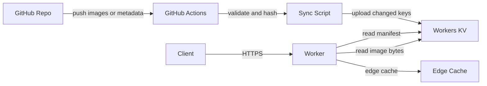

# WallpaperHub v2 技术设计

Feature Name: wallpaperhub-v2
Updated: 2026-09-30

## Description

把壁纸服务从「Go 进程 + VPS 反向代理 GitHub」重构为「Cloudflare Workers + Workers KV」：

- 图片仍以 GitHub 仓库为唯一人工编辑入口，推送后由 GitHub Actions 生成清单并同步到 Workers KV。
- Worker 从 Workers KV 读取清单与图片字节，对外提供检索、筛选、取图接口。
- 取图支持 `random` / `seed` / `daily` / `session` 四种模式，参数切换。
- 同一份 Worker 代码既部署到 Cloudflare，也能用 Docker 在本地或自托管运行（`wrangler dev` + workerd 本地 KV）。

服务只提供原生 REST 接口，移除必应兼容路由。

## Architecture



请求链路：

1. 客户端请求 `/v1/random`，Worker 读取清单（模块内存缓存 + Cache API），按筛选条件与模式选出一张图片。
2. Worker 返回该图片的 JSON 描述，其中 `url` 指向 `/v1/images/{id}/file`。
3. 客户端请求图片地址，Worker 从 KV 取值，写入边缘缓存并返回；命中缓存时直接返回，不再回源。
4. 客户端带 `redirect=1` 时，`/v1/random` 直接 302 到图片地址，适配只接受图片 URL 的前端。

分层职责：

- 边缘层（Cloudflare）：限流、防盗链、缓存、TLS、DDoS 基础防护。
- Worker 业务层：路由、筛选、取图模式、清单解析、错误规范。
- 存储层：KV 绑定（线上）或 workerd 本地 KV（Docker/本地）。
- 数据层：GitHub 仓库中的图片与元数据，流水线负责校验与投递。

## Components and Interfaces

### 目录结构

仓库为单一 npm 包，Worker 源码位于根目录，Go 实现已移除（可从 git 历史找回）。

```
src/
  index.ts              # fetch 入口与路由
  routes/random.ts      # GET /v1/random
  routes/list.ts        # GET /v1/images
  routes/image.ts       # GET /v1/images/{id} 与 /file
  routes/taxonomy.ts    # GET /v1/tags 与 /v1/categories
  routes/health.ts      # GET /healthz
  core/manifest.ts      # 清单加载与缓存
  core/filter.ts        # 筛选条件归一化与匹配
  core/selection.ts     # 四种取图模式
  core/hash.ts          # FNV-1a 索引哈希
  core/errors.ts        # 结构化错误
  core/serialize.ts     # 图片响应序列化
  core/session.ts       # 会话标识推导
  http/ratelimit.ts     # 限流中间件
  http/hotlink.ts       # 防盗链中间件
  http/cache.ts         # 边缘缓存读写
  storage/kv.ts         # KV 读取封装
  types.ts
test/                   # Vitest 用例
scripts/sync.mjs        # GitHub Actions 同步流水线
metadata.json           # 人工维护的图片元数据源
images/                 # 图片目录（沿用现有编号命名）
.github/workflows/sync.yml
wrangler.jsonc
Dockerfile
docker-compose.yml
```

### 路由契约

所有接口前缀 `/v1`，响应为 JSON；错误统一为 `{"error":{"code":"...","message":"..."}}`。

`GET /v1/random`

| 参数 | 说明 |
|------|------|
| `mode` | `random`（默认）、`seed`、`daily`、`session`；非法值按 `random` |
| `seed` | 配合 `mode=seed`，相同筛选与种子返回同一张 |
| `date` | 配合 `mode=daily`，格式 `YYYY-MM-DD`，默认按配置时区当天 |
| `tags` | 逗号分隔，需全部命中 |
| `category` | 单选分类 |
| `orientation` | `landscape` / `portrait` / `square` |
| `min_width`、`min_height` | 尺寸下限 |
| `redirect` | `1` 时返回 302 到图片字节地址 |

响应示例（`mode=random`）：

```json
{
  "id": "01",
  "title": "Blue Haired Girl",
  "category": "anime",
  "tags": ["anime", "illustration"],
  "orientation": "landscape",
  "width": 1920,
  "height": 1080,
  "format": "webp",
  "bytes": 504578,
  "hash": "sha256-06c0eec640104334d275d764adcc4222",
  "url": "https://example.com/v1/images/01/file",
  "page_url": "https://example.com/v1/images/01",
  "mode": "random",
  "manifest_version": 1
}
```

`GET /v1/images`：与 `/v1/random` 相同筛选参数，外加 `page`（默认 1）、`page_size`（默认 24，上限 100），按 `id` 升序返回。
响应为 `{"total": 8, "page": 1, "page_size": 24, "items": [ ... ]}`。

`GET /v1/images/{id}`：返回单张元数据，不存在返回 404。

`GET /v1/images/{id}/file`：返回图片字节；设置 `Content-Type`、`ETag`（等于内容摘要）、`Cache-Control: public, max-age=31536000, immutable`；支持 `If-None-Match` 与 `Range`。

`GET /v1/tags`、`GET /v1/categories`：返回 `{"items":[{"name":"anime","count":3}]}`。

`GET /healthz`：返回 `{"status":"ok","images":8,"manifest_generated_at":"..."}`。

### 存储封装

`storage/kv.ts` 暴露最小接口，便于测试替换：

```ts
interface BlobStore {
  getManifest(): Promise<Manifest | null>;
  getImage(key: string): Promise<ArrayBuffer | null>;
}
```

线上用 `env.KV`（KV 绑定）。Docker/本地用 `wrangler dev` 提供的本地 KV，通过 `.wrangler/state`（Docker 内为 `/data` 卷）持久化。同步脚本在 CI 走 Cloudflare REST API，本地走 `wrangler kv key put --local`，共用同一套键名约定。

KV 没有原生范围读取，`/v1/images/{id}/file` 取回整个值后在 Worker 内切片；图片响应同时写入边缘 Cache API，命中缓存时不消耗 KV 读。KV 免费层限制为 1 GB 存储、每天 10 万次读、每天 1,000 次写、单值 25 MiB，Workers 免费层每天 10 万请求通常先触顶。

### 限流与防盗链

限流优先使用 `unsafe.bindings` 声明的 Cloudflare ratelimit 绑定；绑定缺失或调用出错时回退到按 isolate 的内存计数器，保证本地与 Docker 可用。限流键由 `CF-Connecting-IP` 推导，并区分 `api:` 与 `file:` 两个作用域。防盗链读取 `Origin` 或 `Referer` 的主机名，与 `HOTLINK_ALLOWLIST` 精确或通配匹配；白名单为空或请求不带来源时放行。

### 同步流水线

`scripts/sync.mjs` 流程：

1. 扫描 `images/**`，按受支持扩展名（`.jpg`、`.jpeg`、`.png`、`.webp`、`.avif`、`.gif`）过滤。
2. 读取 `metadata.json`，以文件路径为主键合并标题、标签、分类；缺失时回退为「文件名为标题、目录名为分类、空标签」。
3. 用 `image-size` 计算宽高与方向，用 `node:crypto` 计算 sha256 与字节数。
4. 读取 KV 上的现有 `manifest.json`，逐项比较 `hash`；仅上传新增或变更的键值与最终清单。
5. 通过 Cloudflare REST API 写入 KV，免去额外 SDK 依赖。

流水线只在 `images/**` 或 `metadata.json` 变更时触发，通过仓库 Secrets 提供 `CF_API_TOKEN`、`CF_ACCOUNT_ID`、`KV_NAMESPACE_ID`。

## Data Models

### Manifest

```jsonc
{
  "version": 1,
  "generated_at": "2026-09-30T17:00:00Z",
  "timezone": "Asia/Shanghai",
  "count": 8,
  "images": [
    {
      "id": "01",
      "path": "images/01.webp",
      "title": "Blue Haired Girl",
      "category": "anime",
      "tags": ["anime", "illustration"],
      "width": 1920,
      "height": 1080,
      "orientation": "landscape",
      "format": "webp",
      "bytes": 504578,
      "hash": "sha256-06c0eec640104334d275d764adcc4222"
    }
  ]
}
```

`orientation` 由宽高比较推导：`width > height` 为 `landscape`，`width < height` 为 `portrait`，相等为 `square`。

### 元数据源

`metadata.json` 以图片路径为键，人工补全字段：

```jsonc
{
  "images/01.webp": { "title": "Blue Haired Girl", "category": "anime", "tags": ["anime"] }
}
```

### 取图模式

候选集先经筛选并按 `id` 升序排序，再计算索引：

| 模式 | 索引来源 | 稳定性 |
|------|----------|--------|
| `random` | `crypto.getRandomValues` | 每次不同 |
| `seed` | `hash(seed)` | 同筛选同种子稳定 |
| `daily` | `hash(date + timezone)` | 同一时区自然日内稳定 |
| `session` | `hash(sessionId)` | 同一会话稳定 |

索引取 `hash % candidateCount`，哈希用 FNV-1a 32 位，输出稳定且无需外部依赖。

## Correctness Properties

1. 任一取图模式返回的 `id` 必属于候选集；候选集为空时返回 404。
2. `seed` 模式下，筛选参数与 `seed` 相同则 `id` 相同。
3. `daily` 模式下，同一时区同一自然日内 `id` 相同，跨日变化。
4. 图片响应字节与 KV 中的值一致，`ETag` 等于清单中的内容摘要。
5. 同步流水线重复执行不改变清单内容（幂等），不重复上传未变化对象。
6. 筛选条件组合是交集语义，`total` 等于所有条件同时命中的数量。
7. `tags` 与 `categories` 的计数之和分别等于对应归组后的图片数量。

## Error Handling

| 场景 | 状态码 | 处理 |
|------|--------|------|
| `min_width`/`min_height`/`page` 非数字或越界 | 400 | 返回结构化错误，指出字段 |
| `orientation` 非法 | 400 | 指出允许取值 |
| `date` 格式非法 | 400 | 要求 `YYYY-MM-DD` |
| 筛选无匹配 | 404 | `code: no_match` |
| `id` 不存在 | 404 | `code: not_found` |
| 清单缺失或损坏 | 503 | `code: manifest_unavailable`，记录错误日志 |
| 来源不在防盗链白名单 | 403 | `code: forbidden_origin` |
| 超过限流阈值 | 429 | 带 `Retry-After` |
| 未捕获异常 | 500 | `code: internal`，不返回堆栈 |

KV 读取失败时先返回缓存内容；无缓存则返回 503 并记录日志。

## Test Strategy

- 单元测试（`vitest`）：
  - `core/filter.ts` 的归一化与交集匹配，覆盖空标签、超大尺寸、方向推导。
  - `core/selection.ts` 四种模式的确定性、边界（单元素候选集、空候选集）。
  - 清单解析对缺字段、重复 id、非法摘要的容错。
- 集成测试：用本地 KV 假实现构造清单与图片值，验证随机、列表、字节响应、ETag、Range、404、429、403。测试通过 Node 下的 Vitest 运行，Cache API 缺失时自动退化为直读存储。
- 同步脚本测试：对固定样例图片目录运行，断言生成的清单稳定，且二次运行不上传对象。
- 冒烟测试：`wrangler dev` 启动后跑脚本请求各接口；Docker Compose 启动后覆盖 `Host` 头请求 `/healthz` 与 `/v1/random`。

## Migration and Rollout

1. 仓库内以 Worker 实现替换 Go 实现，并删除旧部署文件；线上 VPS 服务在切流前保持不动，回滚依赖 git 历史。
2. 部署 Worker 到 Cloudflare 并同步 KV，用现有 8 张图验证接口与字节一致性。
3. 把 `wallpaper.kejizero.xyz` 的解析从 VPS 切到 Worker，观察日志与缓存命中。
4. 稳定后停用 VPS 服务并回收残留文件（需用户确认）。
5. 更新 README 与 `.monkeycode/MEMORY.md` 的运维方式。

## References

[^1]: (Website) - [Cloudflare Workers Wrangler commands](https://developers.cloudflare.com/workers/wrangler/commands/)
[^2]: (Website) - [wrangler experimental config type definitions](https://unpkg.com/wrangler@4.129.0/wrangler-dist/experimental-config.d.mts)
[^3]: (Website) - [workerd runtime package](https://npm.io/package/@wrkst/workerd)
