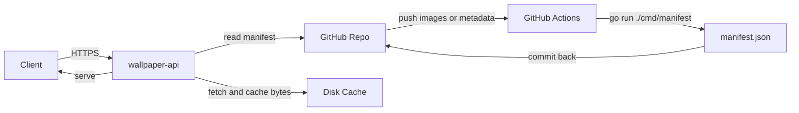

# WallpaperHub

自托管的壁纸 REST API，用 Go 编写。图片存放在 GitHub 仓库，推送后由 GitHub Actions
重新生成 `manifest.json` 并提交回仓库；服务读取清单，对外提供检索、筛选与四种取图模式，
图片字节从 GitHub 拉取后写入本地磁盘缓存。用 Docker Compose 部署，可选用内置 ACME 自动签发
HTTPS 证书。

## 架构



请求链路：

1. 客户端请求 `/v1/random`，服务按清单与筛选条件选出一张图片，返回 JSON 描述。
2. 描述里的 `url` 指向 `/v1/images/{id}/file`。
3. 客户端请求图片地址，服务首次从 GitHub 拉取并缓存到磁盘，之后直接读缓存；响应带 `ETag`
   与长期缓存头，支持 `Range` 与条件请求。
4. 带 `redirect=1` 时，`/v1/random` 直接 302 到图片地址，兼容只接受图片 URL 的前端。

## 接口

所有业务接口以 `/v1` 为前缀，响应为 JSON；错误统一为
`{"error":{"code":"...","message":"..."}}`。

| 方法与路径 | 说明 |
|------|------|
| `GET /v1/random` | 按模式返回一张图片的 JSON 描述；`redirect=1` 时 302 到图片地址 |
| `GET /v1/images` | 分页列出图片，参数与 `/v1/random` 相同，另有 `page`、`page_size` |
| `GET /v1/images/{id}` | 单张图片的元数据 |
| `GET /v1/images/{id}/file` | 图片字节，支持 `Range`、`ETag`、`HEAD`、条件请求 |
| `GET /v1/tags` | 全部标签及图片数量 |
| `GET /v1/categories` | 全部分类及图片数量 |
| `GET /healthz` | 健康检查，含图片总数与清单生成时间 |
| `GET /` | 接口索引 |

`/v1/random` 响应示例：

```json
{
  "id": "01",
  "title": "Blue Haired Girl",
  "category": "anime",
  "tags": ["anime", "illustration"],
  "orientation": "landscape",
  "width": 3840,
  "height": 2160,
  "format": "webp",
  "bytes": 504578,
  "hash": "sha256-db9824d4...",
  "url": "https://wall.example.com/v1/images/01/file",
  "page_url": "https://wall.example.com/v1/images/01",
  "mode": "daily",
  "manifest_version": 1
}
```

## 取图模式

用 `mode` 选择，非法取值按 `random` 处理。

| 模式 | 触发参数 | 稳定性 |
|------|----------|--------|
| `random` | 默认 | 每次不同 |
| `seed` | `mode=seed&seed=<文本>` | 同筛选同种子返回同一张 |
| `daily` | `mode=daily[&date=YYYY-MM-DD]` | 同一自然日内稳定，默认取配置时区的当天 |
| `session` | `mode=session[&session=<id>]` | 同一会话稳定；未提供 id 时下发 `wallpaper_session` Cookie |

索引取 `FNV-1a 32 位哈希 % 候选集大小`，候选集先按 `id` 升序排列，因此结果可复现。

## 筛选参数

`/v1/random` 与 `/v1/images` 共用以下参数，条件之间是交集语义：

| 参数 | 说明 |
|------|------|
| `tags` | 逗号分隔，需全部命中 |
| `category` | 单选分类 |
| `orientation` | `landscape`、`portrait` 或 `square` |
| `min_width`、`min_height` | 尺寸下限 |

## 快速开始

```bash
# 生成清单
go run ./cmd/manifest -root . -out manifest.json

# 以本地目录模式启动，监听 8080
WALLPAPER_SOURCE=local WALLPAPER_MANIFEST_PATH=./manifest.json go run .
```

启动后访问 `http://localhost:8080/healthz` 与 `http://localhost:8080/v1/random` 验证。

## Docker Compose 部署

默认 `docker-compose.yml` 使用 GitHub 模式，图片直接从 `MinimaxFlora/WallpaperHub` 拉取。

### 域名模式（自动 HTTPS）

1. 把域名解析到服务器，确保 80 与 443 可从公网访问，且没有其他服务占用这两个端口。
2. 编辑 `docker-compose.yml`：取消 `80:80` 与 `443:443` 两行端口映射的注释，再填入域名与邮箱：

```yaml
WALLPAPER_DOMAIN: wall.example.com
WALLPAPER_ACME_EMAIL: you@example.com
```

3. 启动：

```bash
# 首次先用 staging 验证，避免触发 Let's Encrypt 速率限制
WALLPAPER_ACME_STAGING=true docker compose up -d --build
```

4. 确认签发成功后，把 `WALLPAPER_ACME_STAGING` 设为 `false`，重新启动：

```bash
docker compose up -d --build
```

证书存放在 `certs` 卷，容器重启不会丢失。

### IP/HTTP 模式

不设 `WALLPAPER_DOMAIN`，服务只监听 8080，用 `http://<ip>:8080` 访问。适合内网或由外部
反向代理终止 TLS 的场景。反向代理时把 `WALLPAPER_BASE_URL` 设为对外的公开地址，服务会用它
生成响应中的绝对 URL。

### 本地目录模式

不想依赖 GitHub 时，让服务读取本仓库的清单与图片：

```yaml
WALLPAPER_SOURCE: local
WALLPAPER_ROOT: /data/repo
WALLPAPER_MANIFEST_PATH: /data/repo/manifest.json
```

并把仓库目录只读挂载到 `/data/repo`。此时加图需要自己跑一次清单生成器。

## 配置项

| 环境变量 | 默认值 | 说明 |
|----------|--------|------|
| `WALLPAPER_SOURCE` | 有 `WALLPAPER_GITHUB_REPO` 时为 `github`，否则 `local` | 图片源 |
| `WALLPAPER_GITHUB_REPO` | 空 | `owner/name` |
| `WALLPAPER_GITHUB_REF` | `master` | 分支、标签或提交 |
| `WALLPAPER_GITHUB_TOKEN` | 空 | 可选，提高 GitHub 速率上限或读取私有仓库 |
| `WALLPAPER_GITHUB_RAW_BASE` | `https://raw.githubusercontent.com` | 原始内容地址，可换镜像 |
| `WALLPAPER_MANIFEST_URL` | 空 | 覆盖清单地址；留空时按仓库推导 |
| `WALLPAPER_MANIFEST_PATH` | `./manifest.json` | 本地模式下的清单路径 |
| `WALLPAPER_MANIFEST_REFRESH_INTERVAL` | `15m` | 清单重新加载间隔，`0` 关闭 |
| `WALLPAPER_ROOT` | `.` | 本地模式的根目录 |
| `WALLPAPER_CACHE_DIR` | `./cache` | 图片缓存目录 |
| `WALLPAPER_ADDR` | `:8080` | HTTP 监听地址 |
| `WALLPAPER_DOMAIN` | 空 | 逗号分隔的域名，设置后启用 HTTPS |
| `WALLPAPER_ACME_EMAIL` | 空 | ACME 账户邮箱 |
| `WALLPAPER_ACME_CACHE_DIR` | `./certs` | 证书缓存目录 |
| `WALLPAPER_ACME_STAGING` | `false` | 使用 Let's Encrypt staging |
| `WALLPAPER_HTTP_ADDR` | `:80` | 域名模式下接收 ACME 挑战的地址 |
| `WALLPAPER_HTTPS_ADDR` | `:443` | 域名模式下的 HTTPS 地址 |
| `WALLPAPER_BASE_URL` | 由域名或请求 Host 推导 | 响应中绝对 URL 的前缀 |
| `WALLPAPER_TIMEZONE` | `Local` | `daily` 模式使用的时区，如 `Asia/Shanghai` |
| `WALLPAPER_RATELIMIT_LIMIT` | `120` | 每窗口请求上限，`0` 关闭限流 |
| `WALLPAPER_RATELIMIT_WINDOW` | `1m` | 限流窗口 |
| `WALLPAPER_HOTLINK_ALLOWLIST` | 空 | 允许取图的来源，逗号分隔，支持 `*.example.com`；留空放行全部 |
| `WALLPAPER_LOG_LEVEL` | `info` | `debug`、`info`、`warn` 或 `error` |

## 添加图片

1. 把图片放进仓库的 `images/` 目录，文件名（不含扩展名）即图片 `id`。
2. 可选：在 `metadata.json` 里补标题、分类与标签；缺省时标题为 `id`，分类为 `uncategorized`，
   标签为空。
3. 推送到 `master`。GitHub Actions 会重新生成 `manifest.json` 并提交回来。
4. 服务在 `WALLPAPER_MANIFEST_REFRESH_INTERVAL` 内加载新清单，图片在首次被请求时下载并缓存。

支持的扩展名：`.jpg`、`.jpeg`、`.png`、`.webp`、`.avif`、`.gif`。

## 清单生成器

```bash
# 在仓库根目录重新生成清单
go run ./cmd/manifest -root . -out manifest.json
```

| 参数 | 默认值 | 说明 |
|------|--------|------|
| `-root` | `.` | 仓库根目录，清单中的 `path` 相对它计算 |
| `-images` | `images` | 图片目录 |
| `-metadata` | `metadata.json` | 元数据文件 |
| `-out` | `manifest.json` | 输出清单路径 |
| `-timezone` | `Asia/Shanghai` | 写入清单的时区 |
| `-version` | `1` | 清单版本 |

生成器计算宽高、字节数与 sha256 摘要。内容未变化时不改写文件，因此重复运行不会产生空提交。

## 测试

```bash
go test ./...
go vet ./...
```

## 说明与限制

- 服务不再依赖 Cloudflare；图片以 GitHub 仓库为唯一人工编辑入口。
- 限流计数保存在进程内存中，多实例部署时各自独立计数。
- `session` 模式依赖客户端保存 Cookie；显式传 `session` 参数时不受影响。
- AVIF 的宽高由最小化的 ISOBMFF 解析器读取；解析失败时宽高记为 `0`，图片仍可正常分发。
